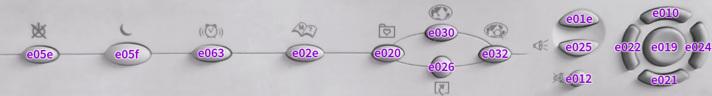

BTC9000A Configuration Script
=============================

Linux config script for BTC 9000A PS/2 keyboard. It assigns key's scancodes to adequate Xorg events.
There is no 'Shortcut' Xorg event, so I assigned it to XF86Documents.

Scancodes:
----------

* e05e - Shutdown
* e05f - Sleep
* e063 - Wake Up
* e02e - Help
* e020 - Favorites
* e030 - WWW / HomePage
* e026 - Shortcut
* e032 - Search
* e01e - Volume Up
* e025 - Volume Down
* e012 - Mute
* e022 - Previous / FastBackward
* e010 - Stop
* e019 - Play/Pause
* e021 - Eject
* e024 - Next / FastForward
